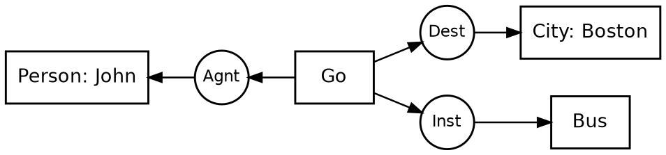

# Rendering CGs in Sowa's Display Form — feasibility analysis

*Status: parked (2026-07-23). Not critical — the linear form and the
concept-type-browser lattice graphs already cover the need. Written up so we can
pick it up if it ever becomes worth doing.*

## The idea

Draw conceptual graphs the way Sowa draws them in his books: concepts as
**rectangles** (`[Person: John]`), conceptual relations as **circles/ovals**
(`(Agnt)`), joined by **arrows**; nested contexts (`Proposition:`, `Situation:`)
as **boxes-within-boxes**; **coreference** shown as a dashed line; N-ary
relations with **numbered arcs**.

## What already exists

The concept-type browser's canonical-graph pane **already renders this display
form**. `web/graph.js`:

- `parseCgString` (~line 247) tokenises a linear CG string into `{src, rel, dst,
  dir}` arcs.
- `arcsToDot` (~line 368) emits Graphviz DOT: concepts as `shape=box`, relations
  as `shape=ellipse`, directed edges. viz.js (already bundled, ~1.4 MB, served at
  `/viz.js`) renders it to SVG in the browser.

So the visual vocabulary is essentially free today. A quick hand-built demo
(Graphviz 15) confirmed all three of the harder Sowa features render fine:

- **Simple relations** ("John goes to Boston by bus") — boxes + circles + arrows,
  reads cleanly.
- **Numbered arcs** (the `Betw` N-ary example) — via edge `taillabel="1"` /
  `taillabel="2"`.
- **Nested contexts + coreference** ("Tom believes Mary wants to marry a sailor")
  — nested `Proposition:`/`Situation:` frames via Graphviz **clusters**, plus a
  dashed coref line via `style=dashed dir=none constraint=false`.

Demo PNGs + DOT sources were left in `~/Documents/cg-sowa-demo/` (not committed;
regenerate from the DOT below if gone).

## The real problem: branch positioning, not the vocabulary

The vocabulary is easy. **Node placement is the hard part**, and it's a
*category* limitation of `dot`, not a bug:

> `dot` is a **layered** engine — every edge wants to cross a rank boundary in
> the `rankdir` direction. A branch that should go **perpendicular** to the main
> flow (e.g. `Inst` dropping straight *down* off `Go`, the way Sowa draws it) is
> against the grain.

Two concrete symptoms from the demo:

1. In the "John goes to Boston" graph, `dot` put the `Inst→Bus` branch to the
   lower-**right** of `Go` instead of straight below it.
2. Trying to *force* `Inst` straight down with `rank=same` + ports made the
   **whole graph rotate 90°** — naive constraints fight the engine and backfire.
3. In the nested example, `dot` strung the three contexts into one long
   horizontal line instead of Sowa's compact stack.

## Two paths

- **Path A — let `dot` flow it.** Accept that every relation becomes a rank-step
  and branches fan out *in* the flow direction rather than perpendicular.
  Completely legible, unambiguously a CG, just not pixel-Sowa. This is a short hop
  from the existing `arcsToDot`. The real gap is in the **parser**, not the
  renderer: `parseCgString` is flat and doesn't yet handle nested
  `[PROPOSITION: [...]]`, coreference labels (`*x`/`?x`), or arc numbering.

- **Path C — compute positions ourselves, then pin them** (Graphviz `neato -n`
  with explicit `pos="x,y!"`, or emit SVG directly). This is where you get true
  Sowa layout: pick a horizontal **spine**, lay it straight, radiate the
  remaining relations above/below, recurse for each nested context and size its
  frame around the result. A bounded but real graph-layout task (a few hundred
  lines), not a research problem.

## The insight that makes Path C tractable

Sowa's spine-vs-radiate decision is driven by **relation semantics**, and *this
ontology already encodes them*. A human draws `Agnt → Verb → Obj` as the
horizontal spine and lets `Inst` / `Dest` / `Manr` / `Loc` / `Time` radiate —
because agent and object are the *primary* arcs. `dot` has no idea `Agnt`
outranks `Inst`; the **relation-type catalog does** (or trivially could, via a
per-relation "layout role" slot — directly analogous to the lexicon-override
slots already in the generation architecture). So the layout heuristic isn't
guesswork; it's a lookup against data we own.

## Alternative engines (if we revisit)

`dot`'s layered model is the wrong tool. The property to look for is
**constraints / port control** and **first-class nested graphs**.

- **cola.js / WebCoLa** — force-directed *with alignment + separation
  constraints*. You say "these nodes share a Y" (spine straight) and "this one is
  below its parent." Best conceptual fit for the spine-vs-radiate goal; runs
  in-browser like viz.js. Essentially "Path C with a library."
- **ELK / elkjs** — a layered algorithm like `dot` but with real **port
  constraints** and genuine **compound/nested** layout. `elkjs` runs in the
  browser, so it could slot in where viz.js is now. Mermaid adopted ELK for
  exactly these reasons. Strongest general-purpose upgrade.
- **yFiles** (yWorks, commercial) — gold standard for orthogonal + nested +
  port-constrained layout; would nail Sowa form, but proprietary/licensed.
- **OGDF** (C++, academic) — real orthogonal drawing algorithms; powerful but
  heavy to integrate into a Lisp/web stack.
- **CG-specific tools that already draw the form** — **CharGer** (Delugach; the
  reference Sowa-CG editor) and **CoGui / Cogitant** (LIRMM Montpellier). Worth
  studying even without integrating. Note: even CharGer's auto-layout is only
  so-so and users often place nodes by hand — a data point that *automatic*
  branch positioning is genuinely hard, industry-wide.

(These are from general knowledge, cutoff Jan 2026 — verify current
versions/APIs before writing code against any of them.)

## Recommended architecture (whenever we do this)

Generate a **graph model server-side in Lisp**, from the real parsed CG object
(which already has full nesting, coreference, and arc data — see
`system/graphing/` for existing Graphviz emission), and ship DOT/SVG to the
browser. **Do not** extend the JS `parseCgString` — re-parsing the linear string
in the browser is fragile and already near its limit. Pick the browser layout
engine (viz.js today; elkjs or cola.js if we want better positioning).

## Guiding constraint: keep the barrier to entry low

This code is meant to be **loaded and used by other people**. A heavyweight or
finicky rendering dependency (a commercial lib, a C++ build, a fragile custom
layout) could dissuade adoption. That argues for: (a) treating Sowa display form
as an *optional* enhancement over the linear form and lattice graphs that already
work, and (b) preferring a pure in-browser, self-contained engine (viz.js →
elkjs/cola.js) over anything that complicates the load/setup path.

---

### Appendix — demo DOT (Graphviz 15), reproducible

**Simple relations** — *John goes to Boston by bus*:

**Numbered N-ary arcs** — the `Betw` example: add `taillabel="1"` /
`taillabel="2"` to the relevant edges.

**Nested contexts + coreference** — *Tom believes Mary wants to marry a sailor*:
use nested `subgraph cluster_prop { label="Proposition:"; ... subgraph
cluster_sit { label="Situation:"; ... } }`, connect into a cluster with
`lhead=cluster_prop` (needs `compound=true`), and draw coref as
`mary -> t [style=dashed, dir=none, constraint=false]`. This renders correctly;
the only Sowa-fidelity miss is that `dot` lines the contexts up horizontally
rather than stacking them — i.e. the same branch-positioning limitation.
